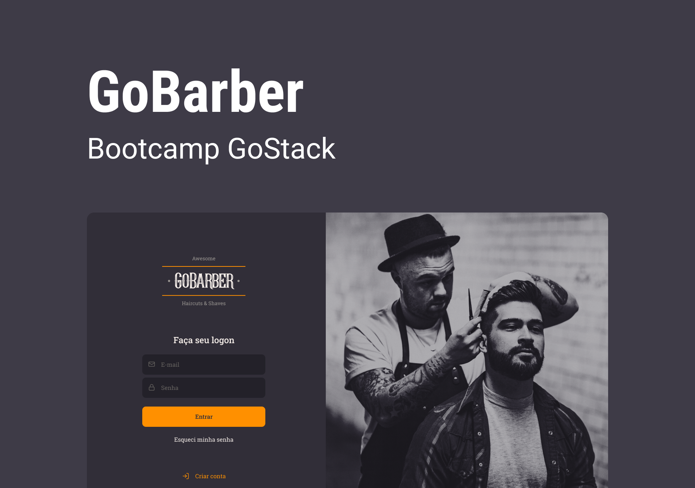

<div align="center">
  
</div>

</br>

<div align="center">


  <p align="center" >
    <a href="#-sobre"> Sobre </a> |
    <a href="#-prévia"> Prévia </a> |
    <a href="#-tecnologias"> Tecnologias </a> |
    <a href="#-iniciar"> Iniciar </a> |
    <a href="#-licença"> Licença </a>
  </p>

</div>

## 📚 Sobre

Projeto desenvolvido durante o bootcamp GoStack 11 da [Rocketseat](https://github.com/Rocketseat).

O projeto Web foi desenvolvido com [ReactJS](https://reactjs.org/) e tem por objetivo criar uma ferramenta de gerenciamento de agenda de barbeiros, facilitando a visualização de horários marcados e livres, filtrando por datas.

Para acessar a api, [clique aqui](https://github.com/thudf/gobarber-api). </br>

Para acessar o aplicativo, [clique aqui](https://github.com/thudf/gobarber-app).

## 💡 Prévia

<div align="center">
  
</div>

<div align="center">
  
</div>

## 🚀 Tecnologias

As princiais tecnologias utilizadas no projeto Web:

- [ReactJS](https://reactjs.org/)
- [TypeScript](https://www.typescriptlang.org/)
- [React Router DOM](https://reacttraining.com/react-router/)
- [React Icons](https://react-icons.netlify.com/#/)
- [UnForm](https://unform.dev/)
- [Yup](https://github.com/jquense/yup)
- [Styled Components](https://styled-components.com/)
- [Polished](https://github.com/styled-components/polished)
- [Axios](https://github.com/axios/axios)
- [Husky](https://github.com/typicode/husky)
- [Eslint](https://eslint.org/)
- [Prettier](https://prettier.io/)
- [EditorConfig](https://editorconfig.org/)

## 💻 Iniciar

Antes de inicar a aplicação, verifique se a [API](https://github.com/thudf/gobarber-api) está rodando

**Clone o projeto e acesse a pasta**

```bash
$ git clone https://github.com/thudf/gobarber-web.git && cd gobarber-web
```

**Siga os passos abaixo**

```bash
# Instale as dependências
$ yarn

# Verifique se a URL definida no arquivo 'src/services/api.ts' está de acordo com a URL da API que está rodando

# Inicie a aplicação
$ yarn start
```

## 🖊 Licença

Este projeto é desenvolvido sob a licença MIT. Veja o arquivo [LICENSE](LICENSE) para saber mais detalhes.

---

<div align="center">
  
  <p>por <strong> Arthur D'Afonseca e Silva</strong> </p>
</div>
